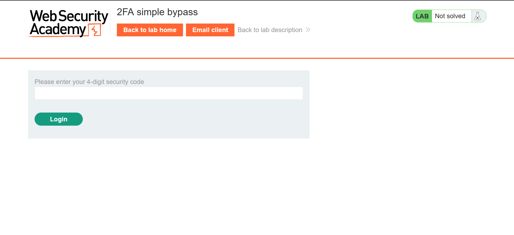
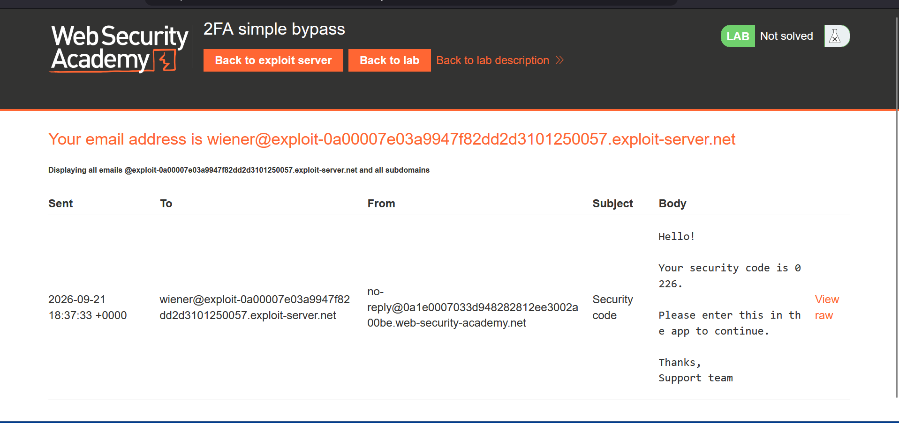
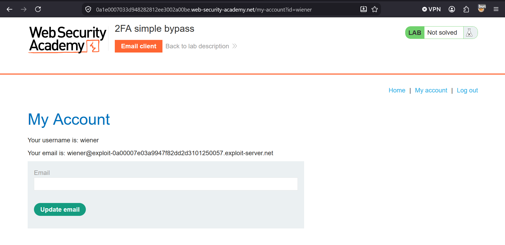

# Lab: 2FA simple bypass

In this lab, we are provided with both the username and password of both the tester and the victim and we have to use them to bypass the 2 Factor Authentiction set by the lab

## Approach

* First, login using the credentials of tester provided,i.e, wiener:peter. When login is pressed, a screen is showed, asking for 2FA code. Click the Email client button at the top to go to the email client and fetch the code to login.

* After the above screen shows, copy the URL and logout
* After logging out, try to login using the victim's credentials.
* When the page asking for the 2FA code shows, use the previously copied URL and just change the id value to the victim's username.
* When the new URL is entered, the 2FA is bypassed and you have successfully logged into the victim's account and hence, the lab is solved.